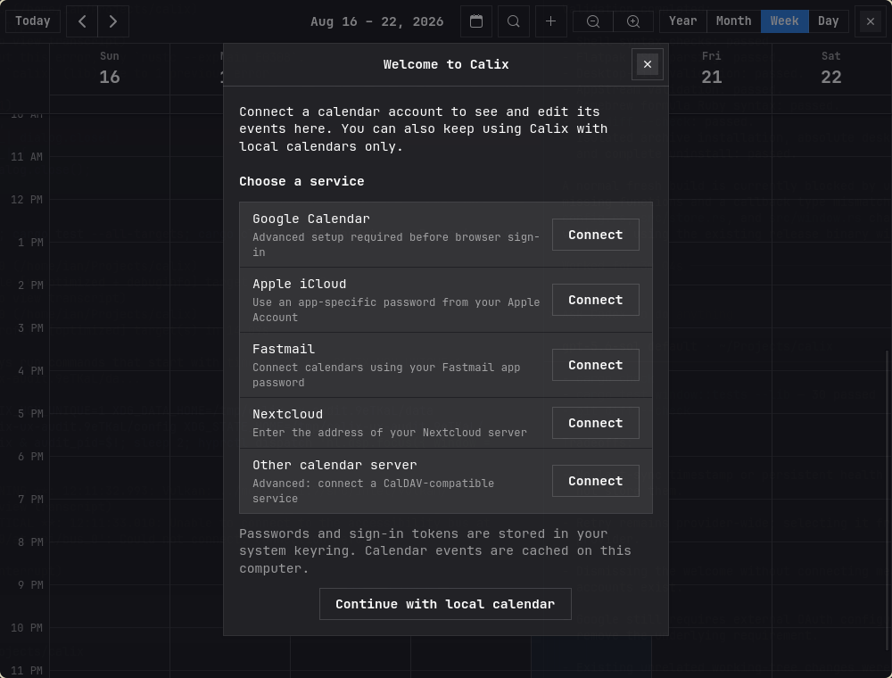
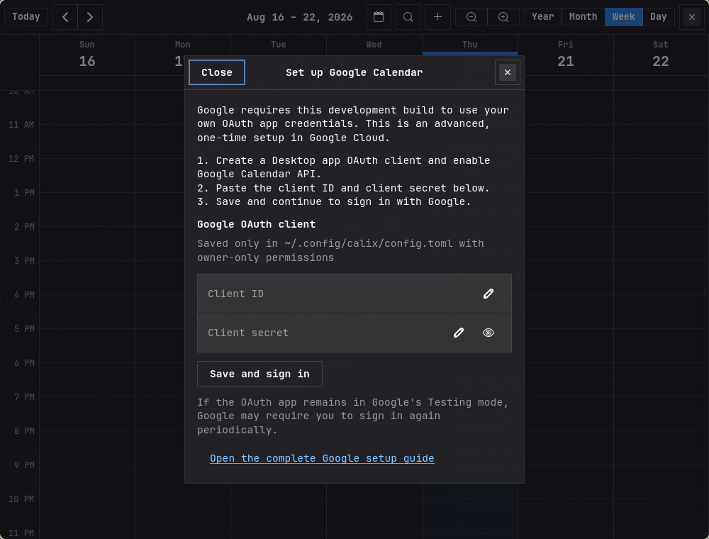
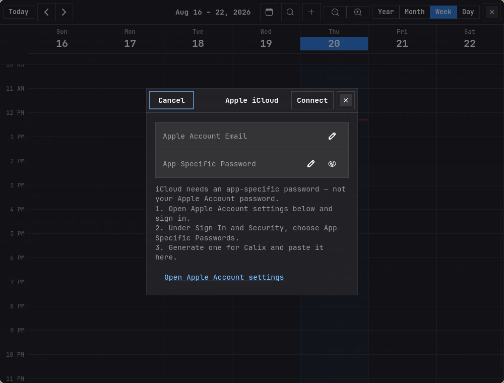

# Calix

[](https://github.com/ianswope/calix/actions/workflows/ci.yml)
[](https://github.com/ianswope/calix/releases/latest)

A fast, native calendar for Linux with a clean GTK4 interface and direct sync
for Google Calendar, Apple iCloud, Fastmail, Nextcloud, and other CalDAV
services.

<picture>
  <source media="(prefers-color-scheme: dark)" srcset="docs/screenshots/month-dark.png">
  
</picture>

Calix keeps the essentials close: year, month, week, and day views; local and
synced calendars; quick event creation; search; reminders; and direct
drag-to-move or resize. On [Omarchy](https://omarchy.org/), it automatically
adopts the active theme's colors.

## Connect your calendars without editing config files

Choose your service inside Calix. Known providers ask only for the details they
need, credentials stay in your system keyring, and calendars refresh
automatically after connection.



<table>
  <tr>
    <td width="50%">
      
    </td>
    <td width="50%">
      
    </td>
  </tr>
  <tr>
    <td align="center"><strong>Google setup stays in the app</strong></td>
    <td align="center"><strong>iCloud includes the steps you need</strong></td>
  </tr>
</table>

Connected accounts have visible sync health and straightforward actions to
retry, update credentials, or disconnect. If local storage cannot be opened,
Calix protects the data and offers recovery and diagnostic actions instead of
silently failing.

<details>
  <summary><strong>See the week view</strong></summary>

  <picture>
    <source media="(prefers-color-scheme: dark)" srcset="docs/screenshots/week-dark.png">
    
  </picture>
</details>

See [what changed in Calix 0.5.0](CHANGELOG.md).

## Install (recommended)

The recommended installation is the prebuilt Linux archive from the
[latest GitHub release](https://github.com/ianswope/calix/releases/latest). It is
the only end-user package currently published by the project; Flatpak, AUR, and
Homebrew support below are development previews rather than stable channels.

1. Download the archive for your CPU and extract it.
2. Open a terminal in the extracted `calix-<version>-linux-<arch>` folder.
3. Run:

   ```sh
   ./install.sh
   ```

This installs Calix under `~/.local` and gives its desktop entry an absolute
path, so it works even when graphical applications cannot see `~/.local/bin`.
Launch **Calix** from the application menu, or run `~/.local/bin/calix`.

### Runtime prerequisites

Calix requires Linux with GTK4 ≥ 4.14 and libadwaita ≥ 1.5. Cloud accounts also
need:

- a Secret Service-compatible system keyring, such as GNOME Keyring or KWallet,
  to store passwords and OAuth tokens;
- `xdg-open` (normally provided by `xdg-utils`) and a default web browser for
  Google sign-in;
- network access for Google, iCloud, or CalDAV sync.

Install the runtime libraries before launching if your distribution does not
already provide them:

| Distribution | Command |
| --- | --- |
| Arch / Omarchy | `sudo pacman -S gtk4 libadwaita xdg-utils gnome-keyring` |
| Debian / Ubuntu | `sudo apt install libgtk-4-1 libadwaita-1-0 xdg-utils gnome-keyring` |

Older distribution releases may not contain the required GTK version. The
binary is not fully self-contained; if it reports a missing shared library, use
your distribution's package manager rather than downloading libraries by hand.

### Update, uninstall, and retained data

To update, download the newer release archive, close Calix, and run its
`./install.sh`; it replaces the application files in the same prefix. To remove
those files, run `./uninstall.sh` from any Calix release archive. Set the same
`PREFIX` for both commands if you installed somewhere other than `~/.local`.

Uninstalling deliberately keeps local calendars and settings in
`${XDG_DATA_HOME:-~/.local/share}/calix`, configuration in
`${XDG_CONFIG_HOME:-~/.config}/calix`, and credentials in the system keyring.
To remove account credentials cleanly, use **Calendars → Manage → Remove** for
each account before uninstalling. Back up the data directory before manually
deleting it if you may want the local calendar later.

## Developer install from a checkout

Building requires Rust 1.85 or newer, GTK4 ≥ 4.14 and libadwaita ≥ 1.5
development headers (`gtk4`, `libadwaita`, and `pkgconf` on Arch;
`libgtk-4-dev`, `libadwaita-1-dev`, and `pkg-config` on Debian/Ubuntu).

```sh
cargo build
cargo test
cargo run
```

For a user-local development install, run `scripts/install-local.sh`. Re-run it
after pulling changes to update, and use `scripts/uninstall-local.sh` to remove
the installed application files. The installer refuses a dirty tree unless
`CALIX_ALLOW_DIRTY=1` is set.

The installed binary is a copy rather than a symlink. These commands identify
and compare it with the checkout:

```sh
calix --version
scripts/check-installed.sh
```

## Experimental package channels

These definitions are maintained for packagers and contributors, but are not
currently published as stable end-user channels:

- **Flatpak:** `flatpak/com.ianswope.Calix.json` is a local development
  manifest, not a Flathub listing. Generate its locked Cargo sources and build
  it with:

  ```sh
  scripts/generate-flatpak-sources.sh
  flatpak-builder --user --install --force-clean build-dir flatpak/com.ianswope.Calix.json
  ```

- **AUR:** `packaging/aur/PKGBUILD` is a release template. Its `SKIP` checksum
  must be replaced with the SHA-256 of the immutable tagged source archive
  before publication. Do not publish it with `SKIP`.
- **Homebrew on Linux:** the tap currently builds the development branch from
  source. There is no checksum-pinned stable formula yet:

  ```sh
  brew tap ianswope/calix https://github.com/ianswope/calix
  brew install --HEAD ianswope/calix/calix
  ```

Package-manager installs should be updated and uninstalled with that same
package manager.

## Building a release archive

Maintainers can run `scripts/build-release.sh`. The output at
`target/dist/calix-<version>-linux-<arch>.tar.gz` contains the binary, desktop
metadata, documentation, `install.sh`, and its matching `uninstall.sh`.
`scripts/check-package.sh` builds the archive and verifies an isolated install,
desktop launch path, metadata, binary version, and complete uninstall.

## Connecting iCloud Calendar

iCloud uses CalDAV with an Apple app-specific password:

1. Sign in at [account.apple.com](https://account.apple.com).
2. Under **Sign-In and Security → App-Specific Passwords**, generate a password for Calix.
3. In Calix, open the calendar sidebar, choose **Connect an account → Apple iCloud**.
4. Enter your Apple Account email and the app-specific password. The password is saved to your system keyring, not to a file.
5. Calix verifies the account, imports its calendars, and keeps them refreshed automatically.

Synced iCloud events can be edited or deleted, including recurring ones: opening an occurrence of a series offers a **This event / All events** choice for both edits and deletes, written back as standard iCalendar overrides and exclusions.

App-specific passwords don't expire — if iCloud sync starts failing, it's usually the local keyring rather than a dead password. [docs/icloud-auth.md](docs/icloud-auth.md) has a one-command check that tells the two apart, plus why Calix uses app-specific passwords instead of Apple's 2FA/token flow.

## Connecting other CalDAV calendars

Any CalDAV server works — Fastmail, Nextcloud, Radicale, mailbox.org, Posteo, and so on. iCloud is just a CalDAV server with a fixed address, so it uses the same engine under the hood.

1. In Calix, choose **Connect an account**, then select Fastmail, Nextcloud, or **Other calendar server**.
2. Enter the server's CalDAV address, your username, and your password:
   - **Server URL** — your provider's CalDAV endpoint, e.g. `https://caldav.fastmail.com/` or your Nextcloud address like `https://cloud.example.com/remote.php/dav`. Pasting the bare server origin usually works too; Calix falls back to the `/.well-known/caldav` bootstrap to find your account.
   - **Username / Password** — most providers want an app-specific password rather than your login password. Generate one in your provider's security settings.
3. The password is saved to your system keyring, not to a file. Calix verifies the connection and refreshes it automatically.

Editing and deleting synced CalDAV events works the same as iCloud, including the **This event / All events** choice on recurring series.

## Connecting Google Calendar

Google is the one provider that needs real setup: Google requires every app to bring its own OAuth client — there's no shared one you can just use. If you just want to try Calix, connect an iCloud or CalDAV account first; those need nothing but a password. Otherwise, setup takes about 10 minutes:

1. Create a project at [console.cloud.google.com](https://console.cloud.google.com) and enable the **Google Calendar API** for it.
2. Under **Google Auth Platform → Audience**, set the app to External, and add your own Google account under **Test users** (the app stays unverified/"Testing," which is fine for personal use — publishing for public verification is a separate, much heavier process not needed here).
3. Under **Data Access**, add the `.../auth/calendar` scope.
4. Under **Clients**, create an OAuth client of type **Desktop app**. Copy the Client ID and Client Secret.
5. In Calix, choose **Connect an account → Google Calendar**, paste the Client
   ID and Client Secret, then choose **Save and sign in**. Calix writes them to
   `~/.config/calix/config.toml` with owner-only permissions; no manual editing
   or restart is required.
6. Complete the browser consent screen. The refresh token is saved to your
   system keyring (Secret Service—GNOME Keyring, KWallet, etc.), not to a file.
   Repeat this for each Google account you want to connect; Calix refreshes them
   automatically.

**Important:** Google OAuth clients left in **Testing** mode can issue refresh
tokens that expire after seven days. If Calix asks you to reconnect every week,
this is a Google project setting rather than lost local data. Move the OAuth
consent screen to **Production** to avoid the Testing-mode lifetime; Google may
show an unverified-app warning and you remain responsible for the project's
scope and access settings.

If you previously connected Google before Calix had multi-account storage, the next automatic or manual refresh will migrate that older saved token into the new account model.

## Using Calendars

The left sidebar lists local calendars and synced Google/iCloud/CalDAV calendars. Use the switch next to each calendar to show or hide it in the month/week/day grid. Remote calendar visibility is local and is preserved across later syncs.

**Year view** shows the twelve months as thumbnails with busy days weighted; clicking a day opens it in Day view. Swiping or the arrows move a whole year at a time.

The calendar button in the header toggles the sidebar, which opens with a mini month for jumping to a date — its arrows move the calendar a month at a time, and clicking a day goes there without changing the view mode. The sidebar has one **Connect an account** action, a refresh button, and an account center for retrying sync, updating sign-in details, and disconnecting accounts.

### Working with events

- **Select**: click an event to select it — a ring marks it, and it stays marked after the popover is dismissed. Click empty calendar space to select that slot instead: the day in month view, the hour in week/day view. The highlight is where `Ctrl+V` will paste. `Esc` clears both.
- **Create**: double-click an empty slot (day cell in month view, hour cell in week/day view) — a single click selects it rather than creating. Or right-click any empty spot for a **New Event** menu at that exact quarter-hour, or use the **+** header button (`Ctrl+N`).
- **Copy, cut and paste**: `Ctrl+C` copies the selected event and `Ctrl+X` cuts it — **Copy** in the event popover does the same thing. Then click the slot you want it on and press `Ctrl+V`, or right-click there and choose **Paste Event**. Pasting onto an hour in week/day view puts the event at that hour; pasting onto a month cell keeps its own time of day, since a month cell names a date and nothing finer. The length comes along, the copy lands back on the calendar it came from, and every part of it is undoable with `Ctrl+Z`. A repeat rule and a guest list are deliberately left behind: a paste makes one ordinary event, not a second series or an invitation nobody chose to send. Cutting a repeating event is refused rather than guessed at — deleting part of a series belongs in the dialog, where you choose between this event and all of them.
- **Drag out a new event**: in week/day view, press on empty grid space and drag to draw the event's span, with a live preview snapped to 15 minutes. The dialog opens pre-filled with exactly the range you drew instead of the default hour. Dragging upward works the same as downward, and the span stops at midnight rather than spilling into the next day.
- **Pick a calendar**: the new-event dialog's calendar dropdown lists only the calendars currently visible in the sidebar; **Show all calendars…** at the bottom expands it to everything. Hiding noisy subscribed calendars once keeps the picker short.
- **Move and resize**: in week/day view, drag an event's body to move it, or its top/bottom edge to resize, with a live preview snapped to 15 minutes; dragging against the top or bottom of the grid auto-scrolls to off-screen hours. In month view, drag a chip to another day. Changes to synced events are pushed back to their source (Google/iCloud/CalDAV), and roll back if the remote update fails.
- **Inspect and RSVP**: click any event for a popover with its time, calendar, location, notes, and attendee replies. Invitations identified as yours offer **Accept**, **Maybe**, and **Decline** without leaving Calix. **Edit** opens the full dialog.
- **Invite**: add comma-separated email addresses while creating an event on Google Calendar. Google delivers updates to invitees; attendee lists remain read-only afterward so ordinary event edits cannot accidentally rewrite the guest list.
- **Location suggestions**: typing in an event's **Location** field offers places this calendar has already used, and then addresses from a geocoder (Photon, over OpenStreetMap data — no API key needed). Arrow keys and Enter pick one, Escape puts the list away. Only the typed prefix is ever sent, and only after a pause in typing; `[places] enabled = false` in `config.toml` turns the geocoder half off and leaves the local suggestions working offline.
- **Search**: the magnifier in the header (`Ctrl+F`) matches event titles, locations, and notes across every visible calendar. Picking a result jumps the grid to that day. Results are capped, and the popover says so when the cap bites rather than passing a truncated list off as the whole answer.
- **Alerts**: pick an alert in the event dialog ("At time of event" up to "1 day before") to get a desktop notification. Alerts are local to this machine and continue after the window is closed. In **Calendars → Manage**, enable **Start Calix when you sign in** to make them reliable across login sessions.

### Keyboard shortcuts

| Shortcut | Action |
| --- | --- |
| `Ctrl+1` / `Ctrl+2` / `Ctrl+3` / `Ctrl+4` | Year / Month / Week / Day view |
| `Ctrl+←` / `Ctrl+→` | Previous / next period |
| `Ctrl+T` | Jump to today |
| `Ctrl+N` | New event |
| `Ctrl+F` | Search events |
| `Ctrl+C` / `Ctrl+X` / `Ctrl+V` | Copy / cut the selected event, paste onto the selected slot |
| `Esc` | Clear the selection (the clipboard keeps what it holds) |
| `Ctrl+Z` / `Ctrl+Shift+Z` | Undo / redo a single-event change |
| `Ctrl+Q` | Quit Calix, including background alerts |

The digits follow the view toggles left-to-right as they appear in the header. Every binding but `Esc` takes Ctrl on purpose: an unmodified key belongs to whatever has focus, so a shortcut can never swallow a character you meant to type into an event title. `Esc` is safe unmodified because nothing on the grid takes typing, and a popover, menu or dialog claims its own `Esc` long before the window sees it.

## Architecture

- `src/date_util.rs` — pure date-math helpers (month grids, week ranges, month/week shifting), unit tested independent of any GTK state.
- `src/views/month_view.rs`, `src/views/week_view.rs` — build a single month-grid or week-grid page for a given anchor date; `src/views/mod.rs` holds shared helpers like the right-click New Event menu.
- `src/views/event_widget.rs` — the event chip/block widgets shared by the views.
- `src/views/drag.rs` — direct-manipulation move/resize for timed blocks in the week/day grid: a `GestureDrag` controller with a snapped live preview and edge auto-scroll, committing only on release (month-view drags use GTK's regular drag-and-drop instead).
- `src/window.rs` — owns the `AdwCarousel` paging between prev/current/next pages, the header bar (Today / prev / next / Month-Week-Day toggle / New Event / Calendars), sidebar account actions, and the current view-mode + date state.
- `src/style.rs` — the app's small CSS (today badge, cell borders, the "now" line, drag preview, and the compact text sizes applied below the window-width breakpoint), plus loading the Omarchy color overrides at startup.
- `src/omarchy.rs` — reads the active Omarchy theme's `colors.toml` (from `~/.local/state/omarchy/current/theme/`, falling back to the older `~/.config/omarchy` location) and recolors libadwaita to match (accent, semantic hues, surfaces, borders, and the theme's declared light/dark mode); a no-op on machines without Omarchy. `calix --print-theme` shows what was resolved.
- `src/lib.rs` — splits the crate: storage, sync, recurrence, alerts and date math always compile, while the GTK frontend sits behind the default-on `gui` feature. `cargo check --no-default-features` builds the backend with no GTK in the dependency graph at all.
- `src/xdg.rs` — XDG base directories resolved from the environment, so the backend doesn't reach for `glib::user_*_dir()`.
- `src/store.rs` — SQLite-backed account/calendar/event storage (create/list/update/delete), with in-memory-DB unit tests independent of the GUI.
- `src/notify.rs` — pure event-alert logic: the dialog's alert choices, which alerts come due in a tick window, and notification wording; the minute tick and `gio::Notification` wiring live in `window.rs`.
- `src/calendar_dialog.rs` — reusable account/calendar list for the sidebar, including per-calendar visibility toggles.
- `src/event_dialog.rs` — the create/edit event dialog (`adw::Dialog` + `EntryRow`/`SwitchRow` form); its calendar picker defaults to sidebar-visible calendars with an expandable full list.
- `src/config.rs` — reads `~/.config/calix/config.toml` for user-supplied API credentials (the Google OAuth client) and the optional `[places]` section that points location lookup at a different geocoder, or switches it off.
- `src/places.rs` — location type-ahead: which prefixes are worth sending, the geocoder request and its response, and how a geocoder's answers merge behind the locations this calendar already knows. No GTK; unit tested against captured responses.
- `src/location_completion.rs` — the widget half of that: the suggestion popover under the Location row, its debounce, and its keyboard handling.
- `src/google/oauth.rs` — the OAuth2 + PKCE sign-in flow (loopback redirect, no embedded browser) and per-account refresh-token storage via the system keyring.
- `src/google/calendar_api.rs` — thin REST client over the Calendar API v3.
- `src/google/sync.rs` — fetches Google calendars and event windows, then upserts/prunes synced rows in SQLite. Google’s selected/hidden state is used only for a calendar’s initial Calix visibility; later sidebar choices are preserved.
- `src/caldav.rs` — the provider-neutral CalDAV engine: principal/calendar discovery (with a `/.well-known/caldav` fallback), event fetch with server-side recurrence expansion, create/update/delete, and the shared sync loop. Used by both iCloud and generic CalDAV accounts; only the credentials differ.
- `src/icloud/` — the iCloud adapter over `src/caldav.rs`: the fixed `caldav.icloud.com` root plus app-specific-password keyring helpers (also reused for generic CalDAV account passwords).

## Roadmap

- [x] Swipeable month/week grid
- [x] Year view — twelve month thumbnails, busy days weighted, click a day to open it
- [x] Sidebar mini month for jumping to a date
- [x] Local event storage (SQLite) + create/edit events
- [x] Google sign-in (OAuth + PKCE, verified by fetching the calendar list)
- [x] Pull Google events from multiple Google accounts into the month/week grid (one-way sync)
- [x] Show/hide connected calendars from a native sidebar
- [x] Pull iCloud events via CalDAV (one-way sync)
- [x] Basic two-way Google sync / editing synced Google events
- [x] Basic two-way iCloud CalDAV sync / editing simple synced iCloud events
- [x] Calendar picker for creating new events directly on Google/iCloud calendars
- [x] Connect any CalDAV server (Fastmail, Nextcloud, Radicale, …) with two-way sync
- [x] Drag to move/resize events in the week/day grid (snapped preview, edge auto-scroll)
- [x] Drag across empty grid space to create an event spanning that range
- [x] Right-click to create an event at a specific spot
- [x] Event inspector popover on click, with the edit dialog one button away
- [x] Undo/redo for creating, editing, moving and deleting a single event (Ctrl+Z, Ctrl+Shift+Z)
- [ ] Undo for restoring an event deleted from a synced calendar, and for whole-series edits
- [x] Keyboard shortcuts for view switching, navigation, today, and new event
- [x] Match the active Omarchy theme's colors automatically
- [x] Recurring event creation (daily/weekly/monthly/yearly), expanded on the grid
- [x] Automatic background sync (on launch and every 15 minutes)
- [x] Recurrence editing for synced CalDAV/iCloud series — edit or delete one occurrence or the whole series
- [ ] Per-occurrence editing for local recurring events; whole-series edits for Google recurring events
- [x] Event alerts / desktop notifications (local to the machine, while Calix runs)
- [x] Event search
- [x] Copy, cut and paste an event onto a selected day or hour
- [x] Location type-ahead from past events and an OpenStreetMap geocoder
- [x] Invitation responses for Google and compatible CalDAV events
- [x] Google invitee authoring when creating events
- [x] Background alerts with optional XDG autostart
- [ ] Packaging (AUR, Flatpak)

## Contributing

Contributions are very welcome — see [CONTRIBUTING.md](CONTRIBUTING.md) for how to get started. Issues labeled [`good first issue`](https://github.com/ianswope/calix/issues?q=is%3Aissue+is%3Aopen+label%3A%22good+first+issue%22) are scoped for a first contribution, and [`help wanted`](https://github.com/ianswope/calix/issues?q=is%3Aissue+is%3Aopen+label%3A%22help+wanted%22) marks the features I'd most like help with.

## License

MIT
