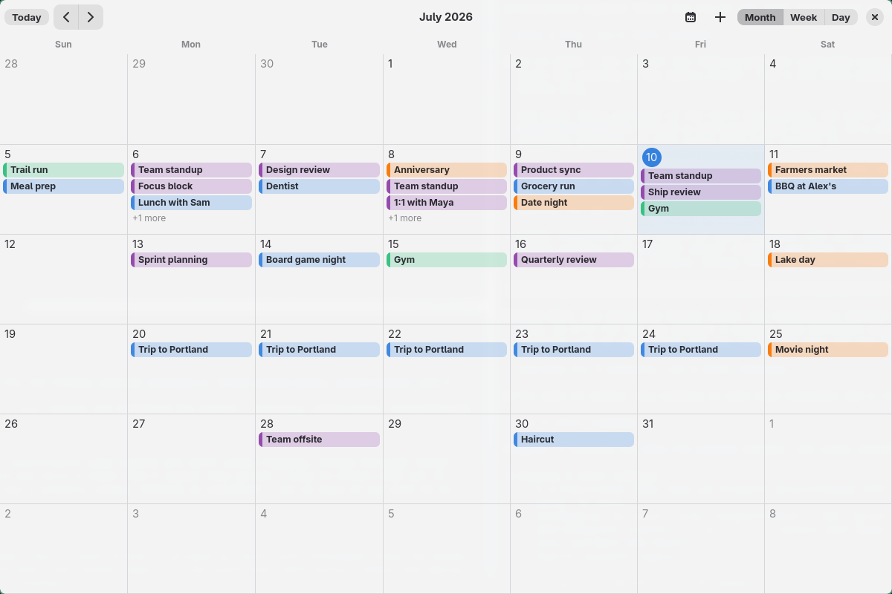
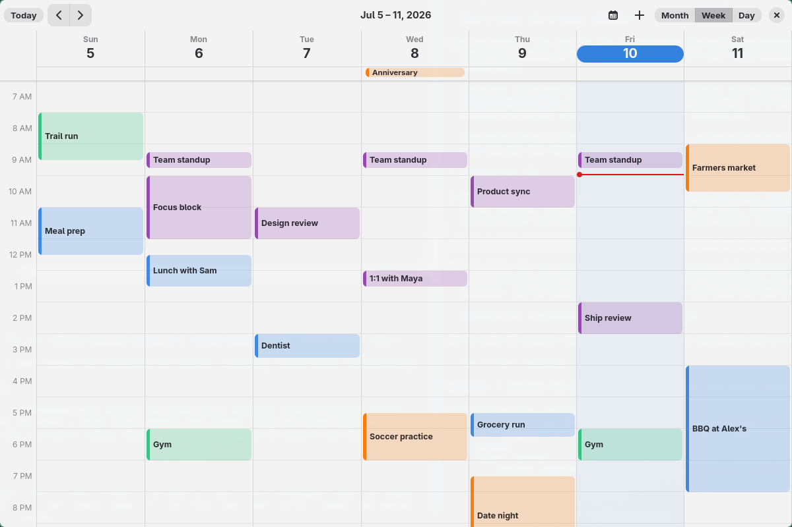

# Calix

[](https://github.com/ianswope/calix/actions/workflows/ci.yml)

A calendar app for Linux, built after moving to [Omarchy](https://omarchy.org/) and wanting the kind of native calendar experience I had on a Mac. [GNOME Calendar](https://apps.gnome.org/Calendar/) doesn't cut it, and Apple Calendar isn't an option here. Native GTK4 + libadwaita, swipeable month/week views, and direct sync with Google, Apple/iCloud, and any CalDAV calendar.

<picture>
  <source media="(prefers-color-scheme: dark)" srcset="docs/screenshots/month-dark.png">
  
</picture>

<picture>
  <source media="(prefers-color-scheme: dark)" srcset="docs/screenshots/week-dark.png">
  
</picture>

**Status: early days.** The swipeable month/week/day grid works, events are stored locally (SQLite) with create/edit/delete, and Google, iCloud, and generic CalDAV sync can pull calendars from multiple accounts into the grid. Connected calendars can be shown/hidden from the calendar sidebar. Events can be created by clicking or right-clicking anywhere on the grid, on local, Google, iCloud, or CalDAV calendars; synced events can be edited or deleted. Events drag to another day in the month grid, and move or resize directly in the week/day grid with a snapped live preview — including synced events, which push the change back to the source. Grid text steps down a size when the window is narrow. On [Omarchy](https://omarchy.org/), Calix picks up the active theme's colors automatically, so it matches the rest of the desktop.

## Building

Requires a Rust toolchain and GTK4 (≥ 4.14) + libadwaita (≥ 1.5) development headers (on Arch: `gtk4`, `libadwaita`; on Debian/Ubuntu: `libgtk-4-dev`, `libadwaita-1-dev`).

```sh
cargo build
cargo test
cargo run
```

## Homebrew

The tap currently ships the development build straight from master:

```sh
brew tap ianswope/calix https://github.com/ianswope/calix
brew install --HEAD ianswope/calix/calix
```

This installs the `calix` binary and the desktop entry/icon. Tagged releases
are published as prebuilt tarballs on the
[releases page](https://github.com/ianswope/calix/releases); a checksum-pinned
stable formula is still to come.

## Flatpak and AUR

The Flatpak manifest is in `flatpak/com.ianswope.Calix.json`. Before building,
generate its dependency manifest with:

```sh
scripts/generate-flatpak-sources.sh
flatpak-builder --user --install --force-clean build-dir flatpak/com.ianswope.Calix.json
```

`packaging/aur/PKGBUILD` is the release package definition for Arch users. It
is pinned to the current release version when publishing to the AUR; replace
its temporary `SKIP` checksum with the SHA-256 for the tagged source archive.

## Installing Locally

For a user-local install from a checkout:

```sh
scripts/install-local.sh
```

This builds `target/release/calix` and installs:

- `~/.local/bin/calix`
- `~/.local/share/applications/com.ianswope.Calix.desktop`
- `~/.local/share/icons/hicolor/scalable/apps/com.ianswope.Calix.svg`

The installed binary is a **copy**, not a symlink, so committing a fix does not
change what you launch until you run `install-local.sh` again. Each build is
stamped with the commit it came from:

```sh
calix --version                 # calix 0.4.0 (v0.4.0-25-gb1c3f07 2026-07-30)
scripts/check-installed.sh      # compares that against the current checkout
```

`check-installed.sh` exits 0 in sync, 1 drifted (listing the commits you have
committed but not installed), 2 if it can't tell. `install-local.sh` refuses a
dirty tree, so a stamped commit always matches what was installed; override with
`CALIX_ALLOW_DIRTY=1` if you really want an experimental build on your desktop.

Uninstall with:

```sh
scripts/uninstall-local.sh
```

## Release Tarball

To build a Linux release archive:

```sh
scripts/build-release.sh
```

The archive is written to `target/dist/calix-<version>-linux-<arch>.tar.gz`. It contains the release binary, desktop entry, icon, docs, and an `install.sh` script that installs to `~/.local` by default. Users still need GTK4 + libadwaita runtime libraries available from their distribution.

## Connecting iCloud Calendar

iCloud uses CalDAV with an Apple app-specific password:

1. Sign in at [account.apple.com](https://account.apple.com).
2. Under **Sign-In and Security → App-Specific Passwords**, generate a password for Calix.
3. In Calix, open the calendar sidebar and click **Add iCloud** in the Accounts section.
4. Enter your Apple Account email and the app-specific password. The password is saved to your system keyring, not to a file.
5. Use **Sync iCloud** to refresh connected iCloud accounts.

Synced iCloud events can be edited or deleted, including recurring ones: opening an occurrence of a series offers a **This event / All events** choice for both edits and deletes, written back as standard iCalendar overrides and exclusions.

App-specific passwords don't expire — if iCloud sync starts failing, it's usually the local keyring rather than a dead password. [docs/icloud-auth.md](docs/icloud-auth.md) has a one-command check that tells the two apart, plus why Calix uses app-specific passwords instead of Apple's 2FA/token flow.

## Connecting other CalDAV calendars

Any CalDAV server works — Fastmail, Nextcloud, Radicale, mailbox.org, Posteo, and so on. iCloud is just a CalDAV server with a fixed address, so it uses the same engine under the hood.

1. In Calix, open the calendar sidebar and click **Add CalDAV** in the Accounts section.
2. Enter the server's CalDAV address, your username, and your password:
   - **Server URL** — your provider's CalDAV endpoint, e.g. `https://caldav.fastmail.com/` or your Nextcloud address like `https://cloud.example.com/remote.php/dav`. Pasting the bare server origin usually works too; Calix falls back to the `/.well-known/caldav` bootstrap to find your account.
   - **Username / Password** — most providers want an app-specific password rather than your login password. Generate one in your provider's security settings.
3. The password is saved to your system keyring, not to a file. Use **Sync CalDAV** to refresh all connected CalDAV accounts.

Editing and deleting synced CalDAV events works the same as iCloud, including the **This event / All events** choice on recurring series.

## Connecting Google Calendar

Google is the one provider that needs real setup: Google requires every app to bring its own OAuth client — there's no shared one you can just use. If you just want to try Calix, connect an iCloud or CalDAV account first; those need nothing but a password. Otherwise, setup takes about 10 minutes:

1. Create a project at [console.cloud.google.com](https://console.cloud.google.com) and enable the **Google Calendar API** for it.
2. Under **Google Auth Platform → Audience**, set the app to External, and add your own Google account under **Test users** (the app stays unverified/"Testing," which is fine for personal use — publishing for public verification is a separate, much heavier process not needed here).
3. Under **Data Access**, add the `.../auth/calendar` scope.
4. Under **Clients**, create an OAuth client of type **Desktop app**. Copy the Client ID and Client Secret.
5. Create `~/.config/calix/config.toml`:
   ```toml
   [google]
   client_id = "your-client-id.apps.googleusercontent.com"
   client_secret = "your-client-secret"
   ```
   This file lives outside the repo and is never read by anything that gets committed — each user (or contributor) needs their own.
6. Run Calix, open the calendar sidebar, and click **Add Google** in the Accounts section. It opens your browser for the Google consent screen; once approved, the refresh token is saved to your system keyring (via Secret Service — GNOME Keyring, KWallet, etc.), not to a file. Repeat this for each Google account you want to connect, then use **Sync Google** to refresh all connected accounts.

If you previously connected Google before Calix had multi-account storage, **Sync Google** will try to migrate that older saved token into the new account model.

## Using Calendars

The left sidebar lists local calendars and synced Google/iCloud/CalDAV calendars. Use the switch next to each calendar to show or hide it in the month/week/day grid. Remote calendar visibility is local and is preserved across later syncs.

**Year view** shows the twelve months as thumbnails with busy days weighted; clicking a day opens it in Day view. Swiping or the arrows move a whole year at a time.

The calendar button in the header toggles the sidebar, which opens with a mini month for jumping to a date — its arrows move the calendar a month at a time, and clicking a day goes there without changing the view mode. The sidebar's Accounts section contains **Add**/**Sync** buttons for Google, iCloud, and CalDAV.

### Working with events

- **Create**: click an empty slot (day cell in month view, hour cell in week/day view), right-click any empty spot for a **New Event** menu at that exact quarter-hour, or use the **+** header button (`Ctrl+N`).
- **Drag out a new event**: in week/day view, press on empty grid space and drag to draw the event's span, with a live preview snapped to 15 minutes. The dialog opens pre-filled with exactly the range you drew instead of the default hour. Dragging upward works the same as downward, and the span stops at midnight rather than spilling into the next day.
- **Pick a calendar**: the new-event dialog's calendar dropdown lists only the calendars currently visible in the sidebar; **Show all calendars…** at the bottom expands it to everything. Hiding noisy subscribed calendars once keeps the picker short.
- **Move and resize**: in week/day view, drag an event's body to move it, or its top/bottom edge to resize, with a live preview snapped to 15 minutes; dragging against the top or bottom of the grid auto-scrolls to off-screen hours. In month view, drag a chip to another day. Changes to synced events are pushed back to their source (Google/iCloud/CalDAV), and roll back if the remote update fails.
- **Inspect**: click any event for a popover with its time, calendar, location, notes, and attendee replies. **Edit** opens the full dialog. Glancing at an event no longer costs a modal to dismiss.
- **Search**: the magnifier in the header (`Ctrl+F`) matches event titles, locations, and notes across every visible calendar. Picking a result jumps the grid to that day. Results are capped, and the popover says so when the cap bites rather than passing a truncated list off as the whole answer.
- **Alerts**: pick an alert in the event dialog ("At time of event" up to "1 day before") to get a desktop notification. Alerts work on any event, including synced ones, but live only on this machine (they aren't written back to Google/CalDAV) and fire while Calix is running — pair them with autostarting Calix if you rely on them.

### Keyboard shortcuts

| Shortcut | Action |
| --- | --- |
| `Ctrl+1` / `Ctrl+2` / `Ctrl+3` / `Ctrl+4` | Year / Month / Week / Day view |
| `Ctrl+←` / `Ctrl+→` | Previous / next period |
| `Ctrl+T` | Jump to today |
| `Ctrl+N` | New event |
| `Ctrl+F` | Search events |

The digits follow the view toggles left-to-right as they appear in the header. Every binding takes Ctrl on purpose: an unmodified key belongs to whatever has focus, so a shortcut can never swallow a character you meant to type into an event title.

## Architecture

- `src/date_util.rs` — pure date-math helpers (month grids, week ranges, month/week shifting), unit tested independent of any GTK state.
- `src/views/month_view.rs`, `src/views/week_view.rs` — build a single month-grid or week-grid page for a given anchor date; `src/views/mod.rs` holds shared helpers like the right-click New Event menu.
- `src/views/event_widget.rs` — the event chip/block widgets shared by the views.
- `src/views/drag.rs` — direct-manipulation move/resize for timed blocks in the week/day grid: a `GestureDrag` controller with a snapped live preview and edge auto-scroll, committing only on release (month-view drags use GTK's regular drag-and-drop instead).
- `src/window.rs` — owns the `AdwCarousel` paging between prev/current/next pages, the header bar (Today / prev / next / Month-Week-Day toggle / New Event / Calendars), sidebar account actions, and the current view-mode + date state.
- `src/style.rs` — the app's small CSS (today badge, cell borders, the "now" line, drag preview, and the compact text sizes applied below the window-width breakpoint), plus loading the Omarchy color overrides at startup.
- `src/omarchy.rs` — reads the active Omarchy theme's `colors.toml` (from `~/.local/state/omarchy/current/theme/`, falling back to the older `~/.config/omarchy` location) and recolors libadwaita to match (accent, semantic hues, surfaces, borders, and the theme's declared light/dark mode); a no-op on machines without Omarchy. `calix --print-theme` shows what was resolved.
- `src/lib.rs` — splits the crate: storage, sync, recurrence, alerts and date math always compile, while the GTK frontend sits behind the default-on `gui` feature. `cargo check --no-default-features` builds the backend with no GTK in the dependency graph at all.
- `src/xdg.rs` — XDG base directories resolved from the environment, so the backend doesn't reach for `glib::user_*_dir()`.
- `src/store.rs` — SQLite-backed account/calendar/event storage (create/list/update/delete), with in-memory-DB unit tests independent of the GUI.
- `src/notify.rs` — pure event-alert logic: the dialog's alert choices, which alerts come due in a tick window, and notification wording; the minute tick and `gio::Notification` wiring live in `window.rs`.
- `src/calendar_dialog.rs` — reusable account/calendar list for the sidebar, including per-calendar visibility toggles.
- `src/event_dialog.rs` — the create/edit event dialog (`adw::Dialog` + `EntryRow`/`SwitchRow` form); its calendar picker defaults to sidebar-visible calendars with an expandable full list.
- `src/config.rs` — reads `~/.config/calix/config.toml` for user-supplied API credentials (currently just the Google OAuth client).
- `src/google/oauth.rs` — the OAuth2 + PKCE sign-in flow (loopback redirect, no embedded browser) and per-account refresh-token storage via the system keyring.
- `src/google/calendar_api.rs` — thin REST client over the Calendar API v3.
- `src/google/sync.rs` — fetches Google calendars and event windows, then upserts/prunes synced rows in SQLite. Google’s selected/hidden state is used only for a calendar’s initial Calix visibility; later sidebar choices are preserved.
- `src/caldav.rs` — the provider-neutral CalDAV engine: principal/calendar discovery (with a `/.well-known/caldav` fallback), event fetch with server-side recurrence expansion, create/update/delete, and the shared sync loop. Used by both iCloud and generic CalDAV accounts; only the credentials differ.
- `src/icloud/` — the iCloud adapter over `src/caldav.rs`: the fixed `caldav.icloud.com` root plus app-specific-password keyring helpers (also reused for generic CalDAV account passwords).

## Roadmap

- [x] Swipeable month/week grid
- [x] Year view — twelve month thumbnails, busy days weighted, click a day to open it
- [x] Sidebar mini month for jumping to a date
- [x] Local event storage (SQLite) + create/edit events
- [x] Google sign-in (OAuth + PKCE, verified by fetching the calendar list)
- [x] Pull Google events from multiple Google accounts into the month/week grid (one-way sync)
- [x] Show/hide connected calendars from a native sidebar
- [x] Pull iCloud events via CalDAV (one-way sync)
- [x] Basic two-way Google sync / editing synced Google events
- [x] Basic two-way iCloud CalDAV sync / editing simple synced iCloud events
- [x] Calendar picker for creating new events directly on Google/iCloud calendars
- [x] Connect any CalDAV server (Fastmail, Nextcloud, Radicale, …) with two-way sync
- [x] Drag to move/resize events in the week/day grid (snapped preview, edge auto-scroll)
- [x] Drag across empty grid space to create an event spanning that range
- [x] Right-click to create an event at a specific spot
- [x] Event inspector popover on click, with the edit dialog one button away
- [x] Keyboard shortcuts for view switching, navigation, today, and new event
- [x] Match the active Omarchy theme's colors automatically
- [x] Recurring event creation (daily/weekly/monthly/yearly), expanded on the grid
- [x] Automatic background sync (on launch and every 15 minutes)
- [x] Recurrence editing for synced CalDAV/iCloud series — edit or delete one occurrence or the whole series
- [ ] Per-occurrence editing for local recurring events; whole-series edits for Google recurring events
- [x] Event alerts / desktop notifications (local to the machine, while Calix runs)
- [x] Event search
- [ ] Packaging (AUR, Flatpak)

## Contributing

Contributions are very welcome — see [CONTRIBUTING.md](CONTRIBUTING.md) for how to get started. Issues labeled [`good first issue`](https://github.com/ianswope/calix/issues?q=is%3Aissue+is%3Aopen+label%3A%22good+first+issue%22) are scoped for a first contribution, and [`help wanted`](https://github.com/ianswope/calix/issues?q=is%3Aissue+is%3Aopen+label%3A%22help+wanted%22) marks the features I'd most like help with.

## License

MIT
